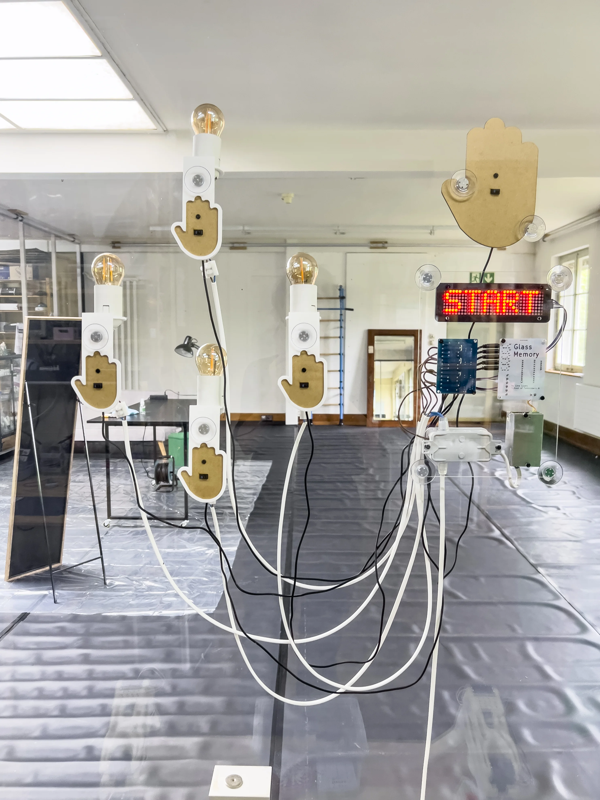

# Glass Memory

A memory game played with the hands, on glass.

Five MDF hands sit on a transparent pane. Four of them hold a lamp. The fifth is Start. A small LED matrix waits, showing a single word. Place a hand on Start, watch the lamps light a sequence, then repeat that sequence by placing your hands on the other four. Each correct round adds one more step. A wrong direction, or a pause that lasts too long, ends the game and returns the panel to waiting.

The electronics stay visible: TRRS cables run across the glass, a custom controller board sits beside the display, and the lamps switch through a relay module. Nothing on the matrix ever names a direction. The sequence exists only as light, then as remembered gesture.



TODO: add an installation video to the repository root and link it here. No MP4 is present in this repo at the time of writing.

---

## How it works

The visitor sees a glass pane with five hand-shaped stations, a red 32×8 LED matrix, and four lamps.

1. The matrix shows **START**.
2. A hand over the Start station begins a game. Start does not light a lamp.
3. The matrix counts **3 · 2 · 1**, then shows the round length as a number.
4. The computer plays the sequence on the four direction lamps only. The display stays blank during playback and never reveals UP, DOWN, LEFT, or RIGHT as text.
5. The matrix shows **GO**. The visitor repeats the sequence on the four direction hands, one press at a time, releasing each hand before the next.
6. A complete correct round shows **OK**. The sequence grows by one random direction and the next round begins.
7. A wrong hand shows **WR**. Taking too long to press, or holding a press too long, shows **TO**. The matrix then shows the number of completed rounds and returns to **START**.

Repeated presses of the same direction count as separate events, as long as the hand is lifted in between. Only Start is accepted while idle; only the four directions are accepted during a turn.

`Start → countdown → watch lamps → GO → repeat → OK → longer sequence`

---

## System overview

```text
Five analog sensors (START, UP, DOWN, LEFT, RIGHT)
        ↓  TRRS cables + adapter boards
Arduino Pro Micro controller
        ↓
Game logic  (sequence, input events, EEPROM calibration)
   ↙                    ↘
MAX7219 matrix         4-channel relay module
(text / numbers)               ↓
                         Direction lamps
```

The controller reads five analog sensor channels, decides when a hand is present, and either plays a lamp sequence or checks the player’s reply. Calibration values live in EEPROM and are loaded at boot; the game firmware does not rewrite them.

---

## Hardware

The running firmware and the KiCad controller project both target a **SparkFun Pro Micro C** (ATmega32U4, [product 15795](https://www.sparkfun.com/products/15795)), socketed on the custom board.

The schematic title block still says “ESP32-S3 controller”. That comment is leftover. The symbol, footprint, pin map, and firmware all use the Pro Micro.

| Role | What is in this repo | Purpose |
| --- | --- | --- |
| Controller | SparkFun Pro Micro C on the [glass-memory](kicad%20files/glass-memory/) PCB | Runs calibration or game firmware |
| Sensor jacks | Five **PJ-320A** TRRS sockets (START, UP, DOWN, LEFT, RIGHT) | Detachable cable to each hand |
| Sensor adapters | Five [sensor-trrs-adapter-pj320a](kicad%20files/sensor-trrs-adapter-pj320a/) boards | PJ-320A jack to a 1×4 sensor header |
| Sensors | Five analog channels; 4-pin modules with **A0 / D0 / GND / VCC** on the adapter silkscreen | Detect a hand over each station |
| Display | External **MAX7219** 4-in-1 matrix (`FC16_HW`, 4 devices → 32×8) | Status text and numbers |
| Relays | External **4-channel relay module**, active LOW | Switch the four direction lamps |
| Power | 2-pin screw terminal **J8**, “5V Power Source” (pin 1 GND, pin 2 +5V) | 5 V rail shared with the Pro Micro `5V` pin |
| Mechanics | Laser-cut hands / board, 3D-printed hand support and matrix bezel | Physical stations on the glass |

The exact sensor part number is not named in the repository. Firmware comments treat the readings as optical (a slow “ambient optical drift” tracker). The adapter exposes both analog (**A0** / `AO`) and digital (**D0** / `DO`) pins; **only analog is used** by the firmware.

The installation photograph shows filament lamps at the four direction stations. This repository does not document lamp voltage or mains wiring. The relay stage switches those loads; any mains work must follow appropriate electrical safety practice.

### Controller pin map

Verified in both [glass-memory-game.ino](glass-memory-game/glass-memory-game.ino) and [glass-memory-calibration-eeprom.ino](glass-memory-calibration-eeprom/glass-memory-calibration-eeprom.ino), and matched on the Pro Micro footprint in the PCB.

| Function | Pin |
| --- | --- |
| START sensor | A10 |
| UP sensor | A9 |
| DOWN sensor | A8 |
| LEFT sensor | A0 |
| RIGHT sensor | A7 |
| Relay IN1 (UP) | D5 |
| Relay IN2 (DOWN) | D4 |
| Relay IN3 (LEFT) | D3 |
| Relay IN4 (RIGHT) | D2 |
| MAX7219 DIN | D15 |
| MAX7219 CS | D14 |
| MAX7219 CLK | D16 |

Relays are **active LOW** (`RELAY_ON = LOW`). START has no relay.

---

## Custom electronics

Two KiCad 10 projects ship with production gerbers. They are the current hardware, not a paper design only.

### Controller — [kicad files/glass-memory](kicad%20files/glass-memory/)

Silkscreen: *Glass Memory Controller 2026 - v1.0*. Outline **60 × 80 mm** with 2 mm corner radii (`Edge.Cuts` from 50.5,45 to 110.5,125), plus M3 holes.

The board is a hub:

- **U1** — socketed Pro Micro C
- **J1–J5** — PJ-320A TRRS jacks labeled START, UP, DOWN, LEFT, RIGHT
- **J6** — Phoenix MKDS 6-pin screw terminal, “RELAY 4 module”: `RELAY_IN4`, `RELAY_IN3`, `RELAY_IN2`, `RELAY_IN1`, `GND`, `+5V` (pins 1–6)
- **J7** — 5-pin header, “MAX7219 module”: `+5V`, `GND`, `DIN`, `CS`, `CLK` (pins 1–5)
- **J8** — Phoenix MKDS 2-pin screw terminal for 5 V in (pin 1 `GND`, pin 2 `+5V`). There is no on-board regulator; U1 `RAW` is unconnected.

Gerbers: [kicad files/glass-memory/production/](kicad%20files/glass-memory/production/).

### Sensor adapter — [kicad files/sensor-trrs-adapter-pj320a](kicad%20files/sensor-trrs-adapter-pj320a/)

Silkscreen: *TRRS PJ-320A 1×4 ADAPTER*. Schematic comment: *PJ-320A TRRS jack → 1×4 female header*.

One adapter sits at each hand. Board size in the gerber job is **24.6 × 15.1 mm**. The 1×4 header (J1) is:

| Pin | Net | Back silk |
| --- | --- | --- |
| 1 | `AO` | `A0` |
| 2 | `DO` | `D0` |
| 3 | `GND` | `GND` |
| 4 | `3V3` | `VCC` |

Gerbers: [kicad files/sensor-trrs-adapter-pj320a/production/](kicad%20files/sensor-trrs-adapter-pj320a/production/).

---

## Sensor cabling

TRRS (PJ-320A, 3.5 mm 4-pole) is used so each hand can be a remote node: power, ground, and analog return travel in one detachable cable from the glass to the hub.

The table below follows the **PCB copper** on both boards (and the matching gerbers), using the custom [TRRS-PJ-320A](kicad%20files/glass-memory/TRRS-PJ-320A.pretty/TRRS-PJ-320A.kicad_mod) footprint labels.

| TRRS contact | Symbol pin | Controller PCB | Adapter PCB |
| --- | --- | --- | --- |
| Sleeve | S / pad 1 | `GND` | `GND` |
| Tip | T / pad 2 | not connected | `DO` (digital out) |
| Ring 1 | R1 / pad 3 | `+5V` | net labeled `3V3` / silk `VCC` |
| Ring 2 | R2 / pad 4 | analog `*_A0` | `AO` |

The controller uses **three** conductors. Tip is unused on the hub, so the sensor digital output is not read.

**Ambiguities to be aware of:**

1. The hub schematic *labels* next to the jacks appear to swap Sleeve and Ring 1 relative to the PCB (`+5V` on Sleeve, `GND` on Ring 1). The PCB, gerbers, and adapter all agree the other way: Sleeve = ground, Ring 1 = power. This README follows the copper.
2. The hub puts **+5 V** on Ring 1. The adapter net for that same contact is named **3V3**. Confirm the sensor module’s supply rating before applying power. TODO: document the intended sensor supply and module part number.

---

## Sensors

Five analog inputs, mapped as START / UP / DOWN / LEFT / RIGHT.

Each reading is an average of four ADC samples (first conversion after a channel change is discarded), then exponentially smoothed (`75%` previous + `25%` new). Presence is not a raw threshold. After calibration, a score of `0%` is the resting baseline and `100%` is the stored hand sample:

- press when score ≥ **50%** and that sensor beats the next by **10%**
- release when score < **30%**
- a press must stay stable **80 ms**; after release, the allowed sensors must stay neutral **120 ms** before the next press can arm

During a player turn the RAM baseline slowly follows ambient optical drift (every 100 ms, only while a sensor is well below the press threshold). EEPROM is not updated. The useful span is not allowed to collapse below a live delta of 20.

The game firmware latches one accepted sensor until *that same* sensor releases, so LEFT → LEFT is two events if the hand lifts in between.

---

## Calibration

Firmware: [glass-memory-calibration-eeprom/glass-memory-calibration-eeprom.ino](glass-memory-calibration-eeprom/glass-memory-calibration-eeprom.ino)

Optical rest levels shift with light and mounting. Calibration measures a clear-pane baseline and a hand sample per station, stores both in EEPROM, and is a **separate sketch** from the game.

Upload this sketch to the Pro Micro (Arduino IDE, board: SparkFun Pro Micro / ATmega32U4). Serial is 115200 baud. Calibration still runs if Serial is not open.

### Automatic flow

The matrix and Serial walk through the same sequence:

```text
CAL
CLEAR   → keep the complete sensor area clear → 3 · 2 · 1 → baseline
START   → prepare a hand over START → 3 · 2 · 1 → hand sample
UP      → same
DOWN
LEFT
RIGHT
DONE    → values written to EEPROM
TEST    → live sensor + relay check
```

Each measurement averages **120** analog samples with **4 ms** between samples. For every sensor the sketch stores:

- `baseline` — mean of the clear-pane capture
- `hand` — mean of that station’s hand capture
- `delta` — `hand − baseline`

Min/max during each capture are printed for noise diagnosis. The EEPROM record is:

```text
magic 0x474D ("GM") · version 1 · baseline[5] · hand[5] · checksum
```

The write is read back immediately (`EEPROM SAVE: OK` or `ERROR`). Values persist across power cycles. Resetting the board runs the whole calibration again.

### Live test

After SAVE, the sketch stays in TEST. An accepted sensor lights its relay (except START) and draws a marker on the matrix (center / top / bottom / left / right edge). Serial prints all five `filtered/score%` values twice a second, tagged `[ACTIVE]`, `[CAND]`, or `[--]`.

Send **`P`** on Serial to reprint the calibration table.

Then upload the game sketch. Do not recalibrate unless the mounting or lighting changed.

---

## Firmware

Current game firmware: [glass-memory-game/glass-memory-game.ino](glass-memory-game/glass-memory-game.ino) (**Game V4**).

It is not the calibration sketch. If EEPROM magic, version, checksum, or any sensor delta is invalid (`|delta| < 2`), the matrix shows **CAL** and the board waits there.

V4 responsibilities:

- load calibration; never write EEPROM
- continuous analog filter; slow RAM baseline tracking
- PRESS → LATCH → RELEASE → NEUTRAL → ARMED input machine
- idle wait on START only
- random direction sequence (UP/DOWN/LEFT/RIGHT), length 1…32
- lamp-only playback (`700 ms` on, `250 ms` gap)
- per-press timeout `10 s`, release timeout `5 s`
- player lamp feedback while the accepted hand is present (`PLAYER_LAMP_FEEDBACK`; set to `0` only for A/B diagnostics — computer playback always uses the lamps)
- serial debug at 115200 when `DEBUG_SERIAL` is 1

---

## Display

A four-module MAX7219 chain (`MD_MAX72XX::FC16_HW`, intensity 3). Firmware maps pixels with **X reversed** and **Y normal** (`physicalCol = 31 − logicalCol`) so the physical panel matches the intended left-to-right text.

| When | Matrix shows |
| --- | --- |
| Idle | `START` |
| Missing calibration | `CAL` (then halt) |
| New game | `3` `2` `1` |
| Before playback | round length as a number |
| Sequence playback | blank |
| Player turn | `GO` |
| Round correct | `OK` |
| Wrong hand | `WR`, then the score |
| Timeout | `TO`, then the score |

The 3D-printed [MAX7219 bezel](3D%20print%20files/glass_memory_max7219_beze.scad) is a rear-entry frame for a 32×8 assembly (~131 mm wide including inter-module gaps).

---

## Relays and lights

Four channels, active LOW, mapped as IN1–IN4 above. During computer playback each step turns on exactly one lamp. During the player turn the matching lamp stays on while that hand remains present (if player feedback is enabled). START never drives a relay. All relays are forced off between steps, on error, and in idle.

---

## Building the system

1. Fabricate the controller and one adapter per sensor (gerbers are under each project’s `production/` folder).
2. Seat the Pro Micro in the U1 socket.
3. Wire the MAX7219 module to J7 and the 4-channel relay module to J6.
4. At each hand, plug the 4-pin sensor into the adapter header and a TRRS cable from the adapter jack to the matching hub jack.
5. Supply 5 V on J8. Confirm sensor supply (see cabling note on +5 V vs `3V3`).
6. Upload **calibration**, clear the pane, then present a hand at each named station.
7. In TEST, confirm each direction lights the intended lamp and that Serial scores separate cleanly.
8. Upload **game** firmware. If the matrix shows `CAL`, calibration is missing or invalid — go back to step 6.
9. From idle, start a game and walk a short sequence before hanging the piece.

Laser-cut hands and board: [laser cut files](laser%20cut%20files/) (72 dpi SVG, plus `board.af`). 3D-printed hand support and matrix bezel: [3D print files](3D%20print%20files/). The hand OpenSCAD file is generated from the 72 dpi SVG contour (hand size ~60 × 80 mm, 3 mm MDF).

---

## Repository structure

```text
.
├── README.md
├── glass-memory.webp                          installation photograph
├── glass-memory-game/                         game firmware V4
│   └── glass-memory-game.ino
├── glass-memory-calibration-eeprom/           EEPROM calibration + live TEST
│   └── glass-memory-calibration-eeprom.ino
├── kicad files/
│   ├── glass-memory/                          controller PCB + gerbers
│   └── sensor-trrs-adapter-pj320a/            per-sensor TRRS adapter + gerbers
├── laser cut files/                           hands, start hand, board (SVG / Affinity)
└── 3D print files/                            hand support + MAX7219 bezel
```

KiCad local history and zip backups exist under the hardware folders; they are snapshots, not the working design.

---

## Troubleshooting

Drawn from the diagnostic paths that actually exist in firmware.

| Symptom | What the firmware is telling you |
| --- | --- |
| Matrix stuck on `CAL` | EEPROM magic/version/checksum failed, or a stored delta is ~0. Run calibration and confirm `EEPROM SAVE: OK`. |
| Start does nothing, directions work (or the reverse) | Wrong TRRS jack, or the allowed-sensor mask: idle listens only to START; play listens only to the four directions. |
| One press counted twice, or LEFT cannot follow LEFT | The hand never returned below the 30% release score for 120 ms. Check Serial scores in the calibration TEST. |
| Wrong lamp or two lamps | Winner margin is 10%. If two sensors both cross 50%, no winner is taken. Recalibrate with only one hand in place. |
| Resting scores creep up after a while | Expected: game tracks ambient drift in RAM only. If a real touch no longer reaches ~100%, recalibrate. |
| Display text mirrored | Firmware already reverses X for this panel. If it looks wrong, the module order or `FC16_HW` wiring does not match this build. |
| Relays on when they should be off | Modules are active LOW. Confirm the board is not treating IN as active HIGH. |
| `TO` during play | 10 s to make the next press, or 5 s to release. |
| Calibration deltas tiny | Baseline and hand samples were too similar. Repeat CLEAR with the pane empty, then place the hand fully over that station. |

Serial (both sketches, 115200) prints per-sensor scores when debug is on. Calibration TEST is the right place to watch `base` / `hand` / `delta` / `noise`.

---

## Software requirements

- Arduino IDE (or any environment that can flash a Pro Micro / ATmega32U4)
- Libraries referenced by `#include`: **MD_MAX72xx**, **SPI**, **EEPROM** (SPI and EEPROM are Arduino core libraries). No versions are pinned in this repo.
- **KiCad 10** (schematic `generator_version "10.0"`)
- **OpenSCAD**, if regenerating the 3D parts

---

## Glass Memory web app

This repository does not contain a web app, simulator, or networked companion. The installation runs entirely on the Pro Micro.

TODO: link a companion app here if it lives in another repo.

---

## About the project

Glass Memory is an embodied memory game: instructions arrive as lamps on glass, and the reply is a sequence of hands. The matrix is deliberately mute about direction. What you remember is a path of gestures, not a string of arrows.

The work sits in physical computing — analog optical sensing, a visible cable plant, calibration as a ritual of settling the pane to a room — rather than a hidden black-box kiosk.

PCB silkscreen: *heavily inspired by Nathan Rabinovitch*. No exhibition history is recorded in this repository.

---

## Credits

- **Lina Lopes** — School of Tomorrow's AI (controller and adapter silkscreen, 2026 v1.0)
- Inspired by **Nathan Rabinovitch**

TODO: license. No `LICENSE` file is present in this repository.
